# ⭐ Yelp System — Microservices Architecture

Distributed microservices application for **business search and recommendations**, powered by the Yelp Open Dataset (~10M+ records).

---

## 🚀 Overview

This project demonstrates a **production-style microservices architecture** with:

* FastAPI-based backend services
* PostgreSQL database (~10M+ records)
* gRPC communication between services
* API Gateway pattern
* Nginx reverse proxy (rate limiting + security headers)
* SSR frontend (Next.js)

---

## 🧭 Quick Architecture Summary

- API Gateway routes external traffic to internal services
- Business Service handles search, details, reviews and city data
- Recommendation Service communicates with Business Service via gRPC
- PostgreSQL stores the Yelp dataset (~10.2M records)
- Redis cache-aside layer improves hot read paths
- Nginx handles reverse proxy, rate limiting and security headers

---

## 🖥️ Application Preview

### 🔍 Search Page

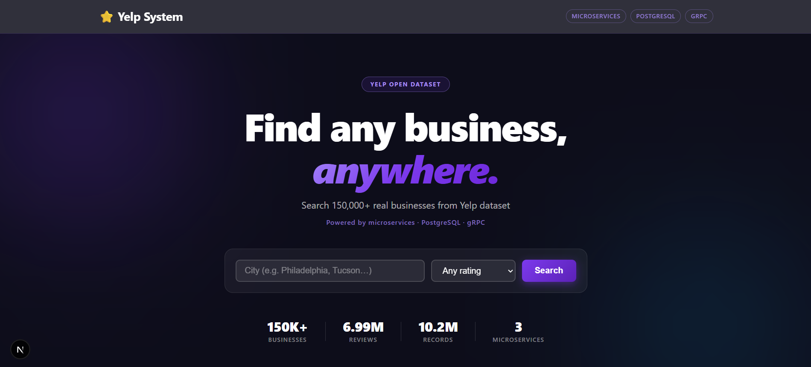

### 📄 Business Detail

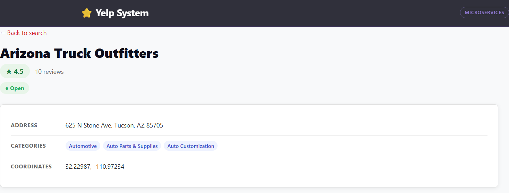

### ⭐ Recommendations Engine

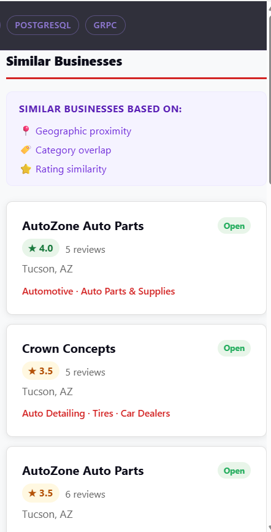

### 📝 Reviews System

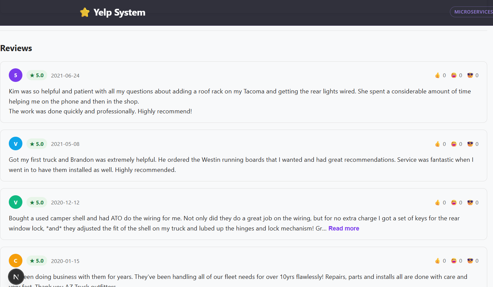

---

## 🧠 System Architecture

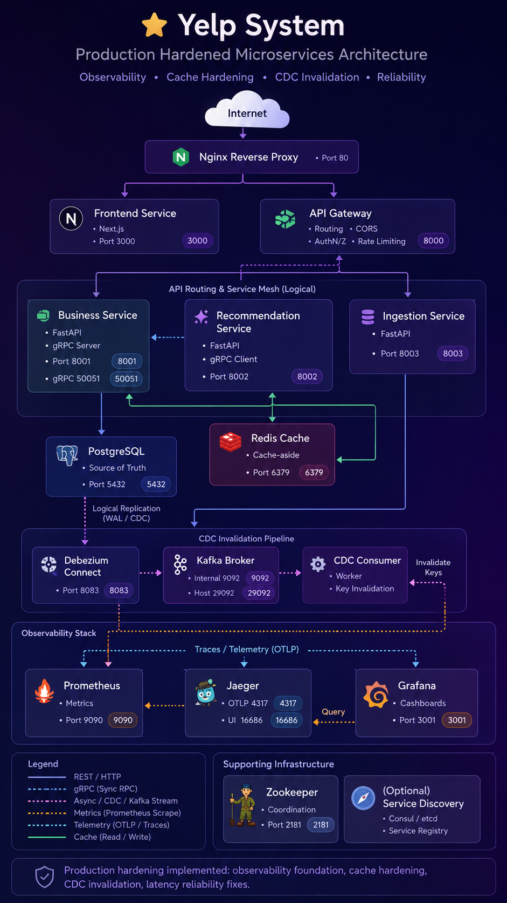

### 📷 Architecture Deep Dive (Latest Diagrams)

#### System Architecture Overview

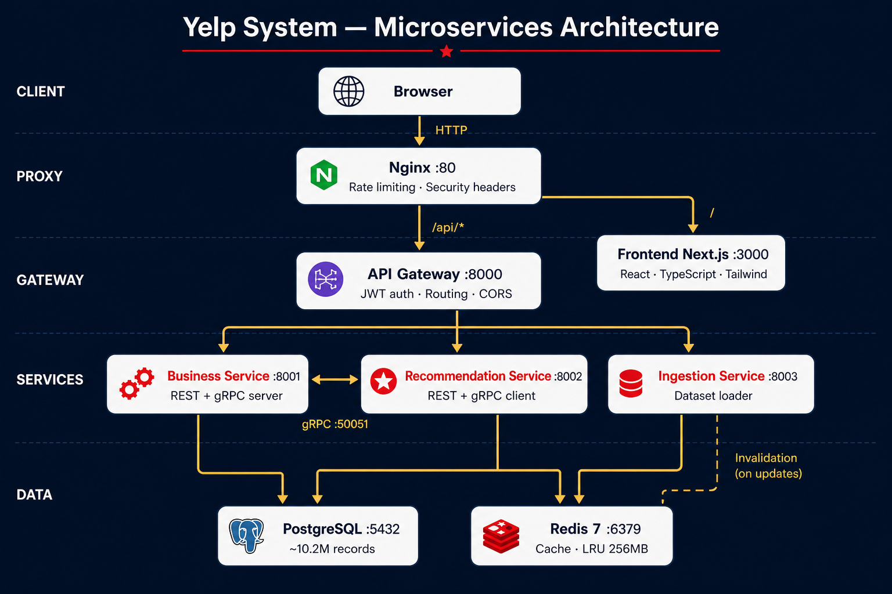

#### Redis Cache-Aside Flow

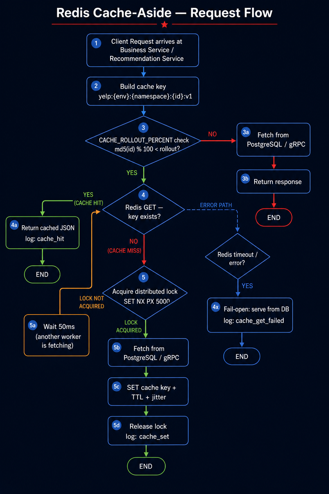

#### Request Lifecycle (End-to-End)

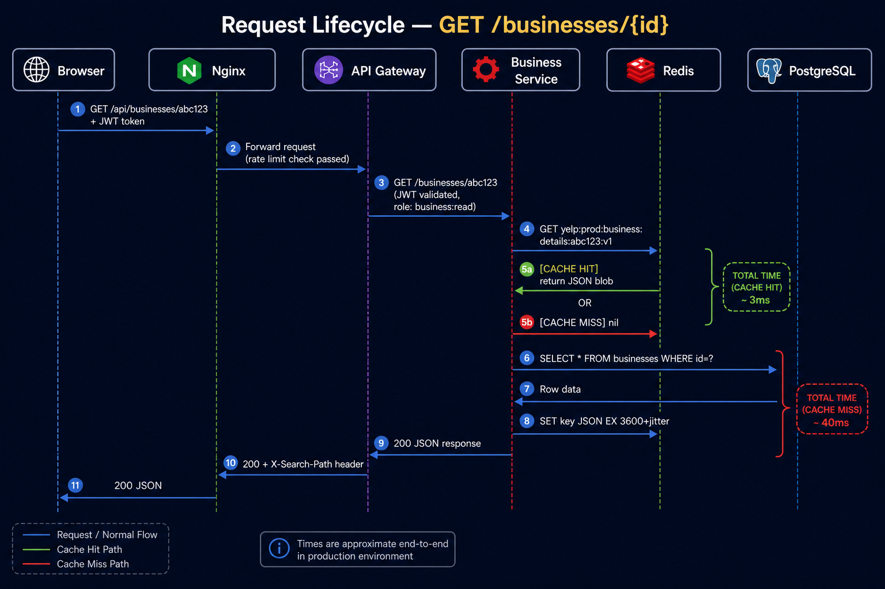

#### Fail-Open and Resilience

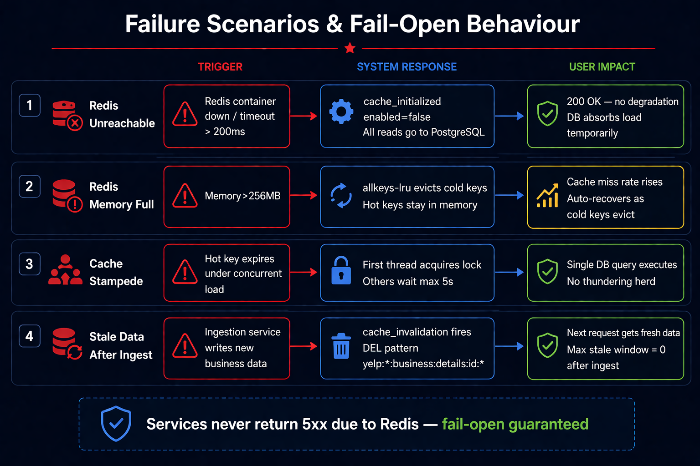

#### Data Ingestion Pipeline

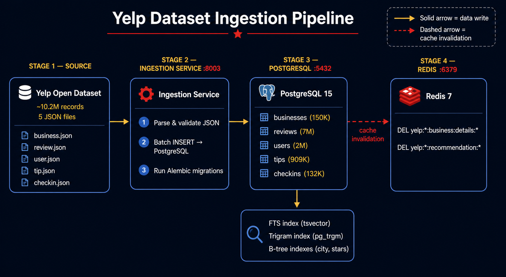

---

## 🗄️ Database Schema

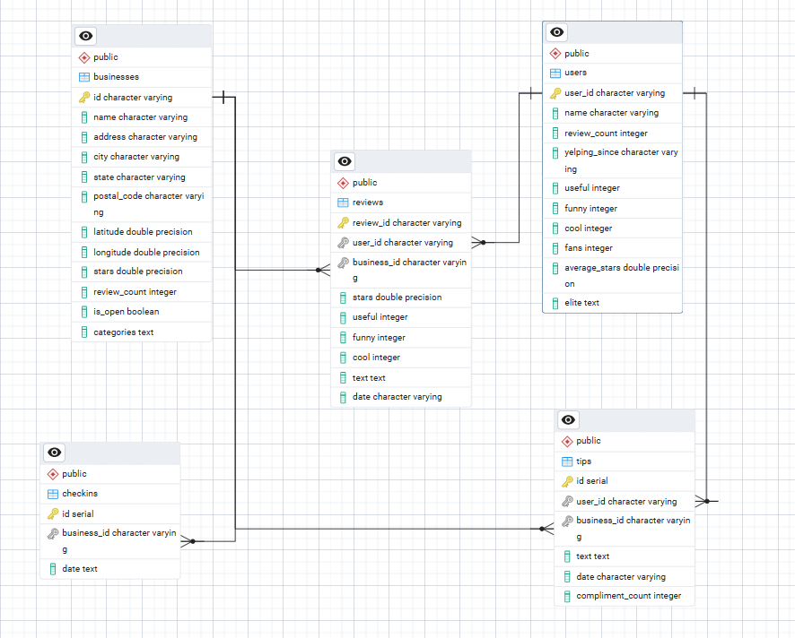

* ~10.2 million records
* 5 main tables: `businesses`, `users`, `reviews`, `tips`, `checkins`
* Indexed for performance (city, stars, review_count…)

---

## 🔍 Core Features

* ✅ Business search (city + rating filters)
* ✅ Full-text search with runtime path control (`search_path=auto|fts|trigram|legacy`)
* ✅ Business detail page (categories, location, status)
* ✅ Recommendation engine (distance + category + rating)
* ✅ Reviews system (paginated, sorted)
* ✅ Interactive map on business detail (Leaflet + OpenStreetMap)
* ✅ Redis cache layer (cache-aside, stampede protection, rollout flags, observability)
* ✅ gRPC communication between services
* ✅ API Gateway routing & validation
* ✅ Rate limiting + security headers (Nginx)
* ✅ Dockerized infrastructure

---

## 🧮 Recommendation Logic

Recommendations are calculated based on:

* 📍 Geographic proximity (Haversine distance)
* 🏷️ Category overlap
* ⭐ Rating similarity
* 🔥 Popularity (review count)
* 🟢 Business status (open/closed)

Custom scoring function ranks candidates and returns the most relevant results.

---

## 📊 Data

| Table      | Records    |
| ---------- | ---------- |
| businesses | 150,346    |
| users      | 1,987,897  |
| reviews    | 6,990,280  |
| tips       | 908,915    |
| checkins   | 131,930    |
| **Total**  | **~10.2M** |

---

## 🧪 Running the Project

### 🚀 Quick Start

Run the full system locally using Docker:

```bash
docker compose up --build
```

After startup, open:

👉 http://localhost
👉 http://localhost/api/businesses

---

### 🔐 Environment Variables

The project uses a layered environment configuration:

- `.env.example` — committed template (safe defaults)
- `.env` — local private overrides (not committed)
- production secrets are injected via CI/CD or runtime environment

For full setup details:

👉 [docs/environment-variables.md](docs/environment-variables.md)

---

### ▶️ Local Development

Start each service individually:

```powershell
# Activate virtual environment
.\venv\Scripts\Activate.ps1

# Business Service
cd services/business-service
uvicorn app.main:app --port 8001 --reload

# Recommendation Service
cd services/recommendation-service
uvicorn app.main:app --port 8002 --reload

# API Gateway
cd services/api-gateway
uvicorn app.main:app --port 8000 --reload

# Frontend
cd services/frontend
npm run dev
```

Frontend runs at:
http://localhost:3000

---

### 🐳 Docker Setup (Recommended)

Run the full system:

```bash
docker compose up --build
```

After startup:

| URL                             | Service           |
| ------------------------------- | ----------------- |
| http://localhost                | Nginx → Frontend  |
| http://localhost/api/businesses | API               |
| http://localhost:3000           | Frontend (direct) |

---

### ⚠️ Notes

- Large dataset (~10M records) is not bundled into Docker images.
- Import is handled separately to avoid oversized images and slow builds.
- Rebuild containers after major backend/frontend/config changes:

```bash
docker compose build --no-cache
docker compose up -d
```

---

## 🧰 Tech Stack

| Layer      | Technology                          |
| ---------- | ----------------------------------- |
| Frontend   | Next.js, React, TypeScript, Leaflet |
| Backend    | FastAPI, Python                     |
| Cache      | Redis 7 (cache-aside, LRU)          |
| Database   | PostgreSQL                          |
| ORM        | SQLAlchemy                          |
| RPC        | gRPC                                |
| Proxy      | Nginx                               |
| Containers | Docker                              |

---

## � Load Testing

The system includes traffic testing for individual services and endpoints.

Tracked metrics:
- success rate
- errors
- average RPS
- P95 latency
- service-by-service endpoint behavior

---

## 🧠 Engineering Focus

This project focuses on understanding how backend services communicate, how traffic flows through an API gateway, how data-heavy systems behave under load, and how caching, indexing and service boundaries affect performance.

---

## �🛠️ Future Improvements

- Add Redis Cluster or managed Redis failover to improve cache availability.
- Replace manual/pattern-based invalidation with event-driven CDC invalidation using Debezium.
- Introduce a CI/CD pipeline with GitHub Actions for automated testing and deployment.

---

## ⚡ Redis Caching

Production-grade cache-aside layer built on Redis 7 for high-traffic read routes:

- `GET /businesses/{id}` → `business.details` (TTL 60 min)
- `GET /businesses/cities` → `business.cities` (TTL 12 h)
- `GET /recommendations/{id}` → `recommendation.by_business` (TTL 15 min)

Implemented capabilities:

- TTL jitter (±15%) to prevent synchronized expiry spikes
- Stampede protection with distributed lock (`SET NX PX`)
- Fail-open behavior when Redis is unavailable (services continue via DB/gRPC)
- Canary rollout controls (`CACHE_ROLLOUT_PERCENT`, `CACHE_SHADOW_MODE`)
- Invalidation after ingestion writes
- Redis hardening (`allkeys-lru`, 256 MB cap, `requirepass`, AOF + RDB, persistent volume)
- Per-service stats endpoint: `/cache/stats`

Docs:

* [docs/redis-cache.md](docs/redis-cache.md) — cache contract, key format, TTL matrix, rollout flags
* [docs/redis-runbook.md](docs/redis-runbook.md) — operations, alerting, incidents, backup/restore

---

## 📡 API Endpoints

All external requests go through the **API Gateway** (`:8000`).

---

## 🔎 Search & Observability

Business search supports runtime path control with safe fallback (`auto | fts | trigram | legacy`) and emits structured metrics through headers and logs.

For full details (query params, fallback behavior, response headers, `search_metrics` fields, cURL examples, and frontend debug panel), see:

* [docs/search-observability.md](docs/search-observability.md)

---

## 🔐 JWT Authentication (API Gateway)

The API Gateway validates bearer tokens, required roles, and runtime user status before forwarding protected requests.

For full details (claims, `401/403` behavior, env configuration, cURL examples, and frontend token propagation), see:

* [docs/jwt-authentication.md](docs/jwt-authentication.md)

---

### 🏢 Business Endpoints

| Method | Endpoint                   | Description                                                      |
| ------ | -------------------------- | ---------------------------------------------------------------- |
| `GET`  | `/businesses`              | Search businesses (`?city=`, `?query=`, `?search_path=`, `?min_stars=`, `?page=`, `?limit=`) |
| `GET`  | `/businesses/{id}`         | Get business details by ID                                       |
| `GET`  | `/businesses/{id}/reviews` | Get paginated reviews (`?page=`, `?limit=`)                      |

---

### ⭐ Recommendation Endpoints

| Method | Endpoint                | Description                        |
| ------ | ----------------------- | ---------------------------------- |
| `GET`  | `/recommendations/{id}` | Get similar businesses (`?limit=`) |

---

### ❤️ Health Check

| Method | Endpoint  | Description               |
| ------ | --------- | ------------------------- |
| `GET`  | `/health` | API Gateway health status |

---

## 📌 Notes

* Built as a **production-style system design project**
* Focus on:

  * scalability
  * service isolation
  * clean architecture
* Dataset: **Yelp Open Dataset (~10M+ records)**

Additional implementation and debugging notes are available in docs/engineering-notes.md.
---

## 👤 Author

**Stjepan Velc**

Backend Developer focused on **Python, FastAPI, PostgreSQL, and distributed systems**.

Interested in:
- system design
- data-intensive applications
- scalable backend architecture

🔗 GitHub: https://github.com/StjepanVelc


